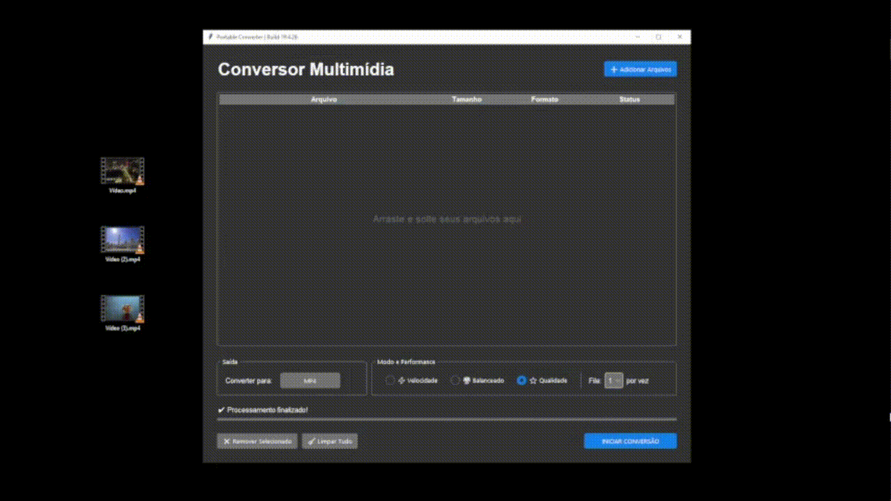
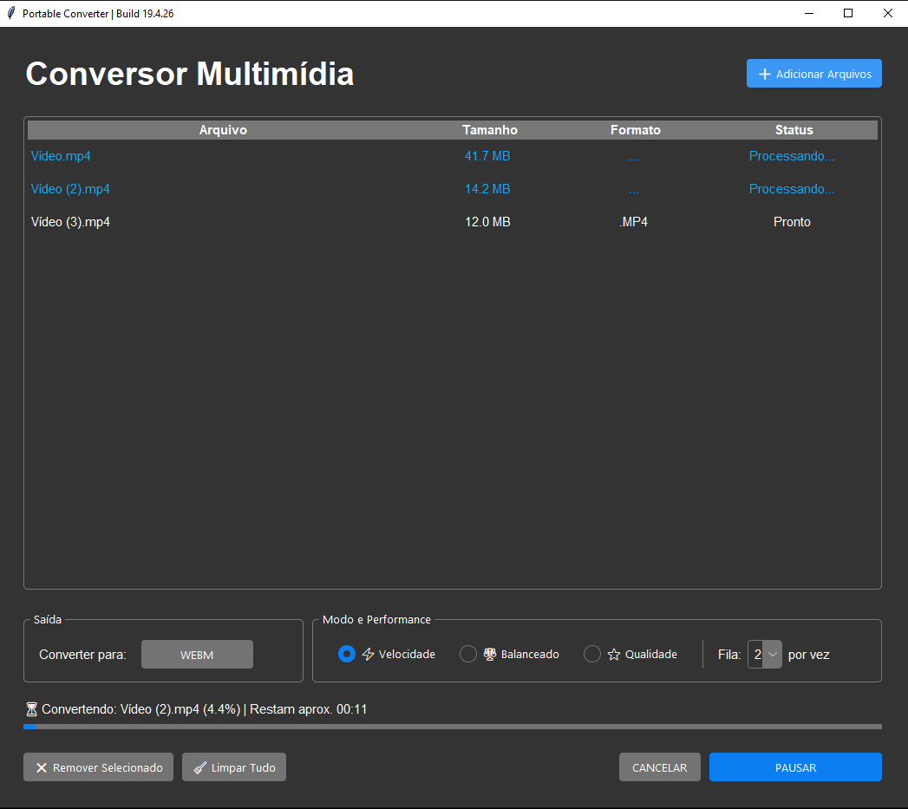
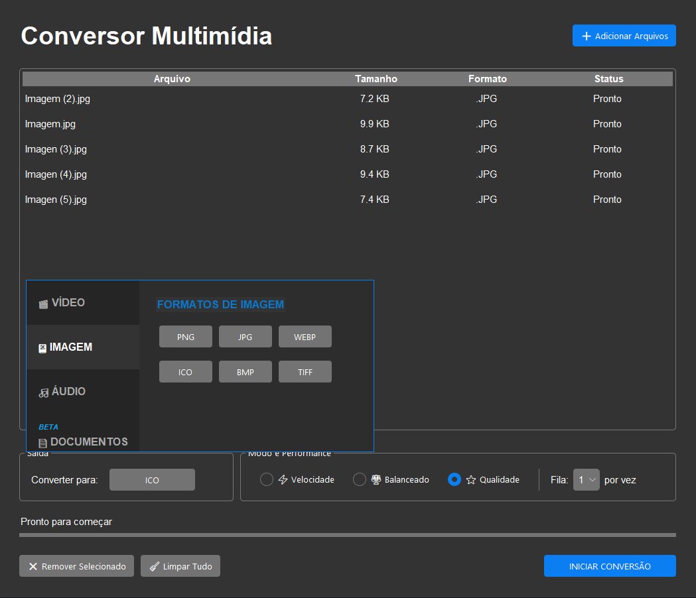
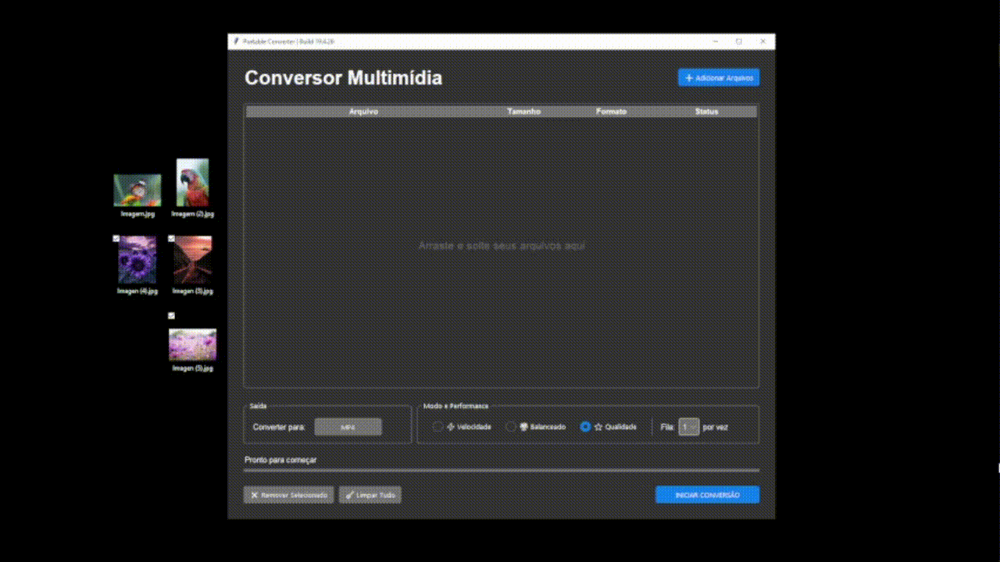

# Portable Converter - v19.4.26

[](https://www.python.org/)
[](https://ffmpeg.org/)
[](https://python-pillow.org/)
[](https://github.com/rdbende/Azure-ttk-theme)

Um conversor multimídia simples, leve e eficiente. Desenvolvido para facilitar a conversão de arquivos do dia a dia com uma interface intuitiva utilizando o tema Azure Dark.

> [!TIP]
> **DOCUMENTOS (MODO BETA):** A funcionalidade de conversão de documentos está em fase experimental. Suporta PDF para DOCX/TXT e TXT para PDF.
>
---

<p align="center">
  
</p>

---

## Funcionalidades
* **Interface Moderna**: Visual limpo e focado em usabilidade com suporte a modo escuro.
* **Conversão em Lote**: Processe múltiplos arquivos simultaneamente para ganhar tempo.
* **Controle de Performance**: Escolha entre 1 a 4 processos paralelos e ajuste a velocidade do motor (Presets).
* **Arrastar e Soltar**: Suporte nativo para importação de ficheiros via Drag and Drop.

---

## Tecnologias e Suporte
* **Vídeo e Áudio**: Processamento de alto desempenho via motor FFmpeg (MP4, AVI, MKV, MP3, etc).
* **Imagens**: Gerenciamento e conversão rápida de formatos (PNG, JPG, WEBP, ICO) através da biblioteca Pillow.
* **Documentos**: Integração com PyMuPDF e pdf2docx para fluxos de texto.

---

## Demonstração Visual

| Fila de Conversão | Seleção de Formatos |
| :---: | :---: |
|  |  |

*Legenda: Visualização da interface principal e do menu de seleção de categorias.*

> [!WARNING]
> **NOTAS DE PERFORMANCE E MULTITASKING:**
> O processamento simultâneo de múltiplos arquivos exige muito do hardware. 
> - **Recomendação:** Utilize processadores com múltiplos núcleos (Quad-core ou superior) para uma experiência fluida ao converter mais de 2 arquivos por vez.
> - **Atenção:** Caso sinta lentidão ou o programa "congele" momentaneamente, reduza a quantidade de processos paralelos para 1 ou 2.
---

## Como usar

### 1. Requisitos do FFmpeg
Por ser um componente pesado, o FFmpeg não está incluído no repositório.
1. Baixe os binários oficiais em [ffmpeg.org](https://ffmpeg.org/download.html).
2. Crie uma pasta chamada `ffmpeg` na raiz do projeto.
3. Coloque o executável no caminho: `ffmpeg/bin/ffmpeg.exe`.

### 2. Instalação
No terminal, instale as dependências necessárias:
```
pip install -r requirements.txt
```
### 3. Execução
Como o código-fonte está organizado na pasta `src`, utilize o comando:
```
python src/conversor.py
```

### Estrutura de Arquivos
```
├── azure/                  # Tema visual padrão Dark Mode.
├── ffmpeg/                 # Pasta para os binários do FFmpeg (Manual)
├── src/                    # Código-fonte principal
│   └── conversor.py        # Script do aplicativo
├── requirements.txt        # Dependências de bibliotecas
└── README.md               # Documentação do projeto
```

<p align="center">
   
</p>
